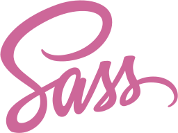

# 自述

> ​:books: css 学习笔记。
>

## 内容

### CSS3

> 层叠样式表 (Cascading Style Sheets，常缩写记作 CSS）， 是一种样式表语言，用来描述 HTML 或 XML（包括如 SVG、XHTML 之类的 XML 分支语言）文档的呈现。CSS 描述了在屏幕、纸质、音频等其它媒体上的元素应该如何被渲染的问题。
>
> CSS3 是级联样式表 / 层叠样式表(Cascading Style Sheets)语言的最新进化，旨在扩展CSS2.1。

### Less

> Less 是一门 CSS 预处理语言，它扩展了 CSS 语言，增加了变量、Mixin、函数等特性，使 CSS 更易维护和扩展。
>
> Less 可以运行在 Node 或浏览器端。

[**github**](https://github.com/less/less.js) | [**官方文档**](http://lesscss.org/) | [**中文文档**](http://lesscss.cn/)

### Sass

> Sass 是一款强化 CSS 的辅助工具，它在 CSS 语法的基础上增加了变量 (variables)、嵌套 (nested rules)、混合 (mixins)、导入 (inline imports) 等高级功能，这些拓展令 CSS 更加强大与优雅。使用 Sass 以及 Sass 的样式库（如 [Compass](http://compass-style.org/)）有助于更好地组织管理样式文件，以及更高效地开发项目。

[**github**](https://github.com/sass) | [**官方文档**](http://sass-lang.com/) | [**中文文档**](https://www.sass.hk/)

### PostCSS

> PostCSS 是一个允许使用 JS 插件转换样式的工具。 这些插件可以检查（lint）你的 CSS，支持 CSS Variables 和 Mixins， 编译尚未被浏览器广泛支持的先进的 CSS 语法，内联图片，以及其它很多优秀的功能。
>

[**github**](https://github.com/postcss/postcss) | [**官方文档**](http://postcss.org/)

## 约定

- **codes**：所有示例代码存放于 `codes` 目录。

- **docs**：所有文档存放于 `docs` 目录。并且文档遵循 [**GitBook**](https://github.com/GitbookIO/gitbook) 规范。

- **git**：使用 [**gitmoji**](https://github.com/carloscuesta/gitmoji/) 规范填写提交信息（带图标的提示信息很有趣）。
